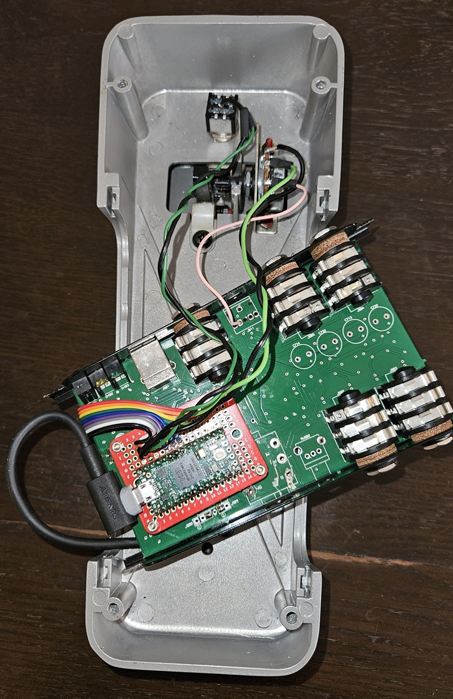
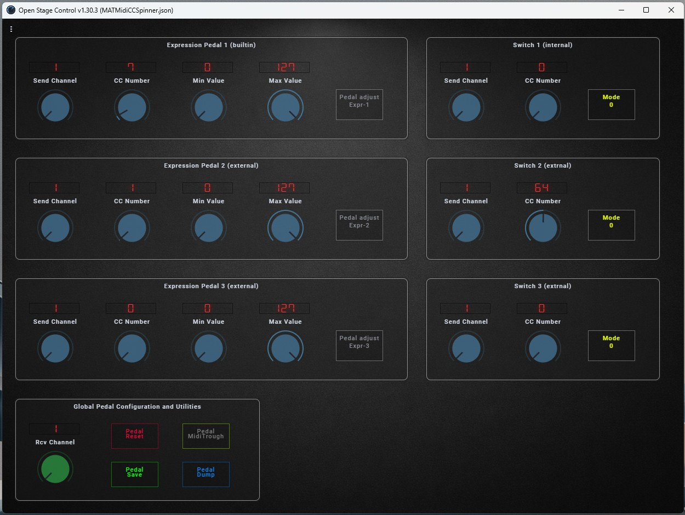
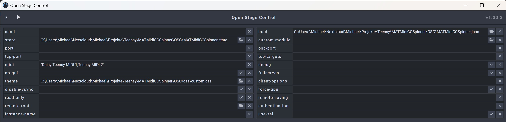

# MATMidiCCSpinner

USB-MIDI Multi Expression Controller for the Teensy 4.0 featuring:

- 3 expression pedal / potentiometer inputs
- 3 footswitch inputs
- USB MIDI CC transmission
- Runtime configuration via incoming MIDI CCs
- EEPROM persistence with CRC validation
- Potentiometer calibration
- Autosave functionality
- MIDI activity LEDs
- MIDI through
- Seamless integration with Linux, Windows, or Mac.

It compiles on Ardiuno IDE with Arduino AVR Board extension.

---
# Use Case

I developed this project to give an old IK Multimedia StealthPedal a second life.
All original electronics were replaced with a Teensy running this custom firmware,
while keeping the beautifully engineered original enclosure.
The result is a fully USB-MIDI compliant device with no proprietary drivers,
no vendor lock-in, and complete configurability — 
all at a fraction of the cost of comparable commercial controllers.
Absolutely love how it turned out.



# Features

## Open Stage Control configuration GUI

In folder "OSC" you will find a control GUI.



It is based on my [OSC Template](https://github.com/SanMichele/MH_OSC).

Please refer to [OSC Documentation](https://openstagecontrol.ammd.net/docs/getting-started/introduction/)
on how to get this running.

Enter the required files into OSC like this:



## Potentiometers

Each potentiometer supports:

- MIDI CC number
- MIDI send channel
- MIDI minimum value
- MIDI maximum value
- Analog minimum calibration
- Analog maximum calibration

Additional features:

- Smoothed ADC values
- Deadband filtering against MIDI jitter
- Calibration mode
- 12-bit ADC resolution

---

## Footswitches

Each switch supports:

- MIDI CC number
- MIDI send channel
- OFF value
- ON value
- Operating mode:
  - Momentary
  - Toggle

Additional features:

- Debouncing
- Toggle state handling

---

## EEPROM Configuration

Persistent storage with:

- Magic number validation
- Version validation
- CRC16 integrity check

Automatic delayed autosave supported.

---

# Hardware

## Teensy 4.0 Pin Mapping

| Function | Pin |
|---|---|
| SW1 | 22 |
| LED3 | 21 |
| LED2 | 20 |
| LED1 | 19 |
| SW2 | 18 |
| SW3 | 17 |
| POT1 | 14 |
| POT2 | 15 |
| POT3 | 16 |

---

# LEDs

| LED | Function |
|---|---|
| LED1 | MIDI OUT activity |
| LED2 | MIDI IN activity |
| LED3 | Calibration indicator |

---

# MIDI Functions

## Outgoing MIDI CCs

The potentiometers and footswitches transmit USB MIDI Control Change messages.

---

## Incoming MIDI CCs

The complete device configuration can be controlled via incoming MIDI CC messages.

Incoming configuration messages are only accepted on:

```text
cfg.receiveChannel
```

---

# MIDI Configuration Matrix

## Pot 1

| CC | Function |
|---|---|
| 100 | Send Channel |
| 101 | CC Number |
| 102 | MIDI Min |
| 103 | MIDI Max |
| 104 | Calibration Start/Stop |

## Pot 2

| CC | Function |
|---|---|
| 105 | Send Channel |
| 106 | CC Number |
| 107 | MIDI Min |
| 108 | MIDI Max |
| 109 | Calibration Start/Stop |

## Pot 3

| CC | Function |
|---|---|
| 110 | Send Channel |
| 111 | CC Number |
| 112 | MIDI Min |
| 113 | MIDI Max |
| 114 | Calibration Start/Stop |

---

## Switch 1

| CC | Function |
|---|---|
| 115 | Send Channel |
| 116 | CC Number |
| 117 | Mode |

## Switch 2

| CC | Function |
|---|---|
| 118 | Send Channel |
| 119 | CC Number |
| 120 | Mode |

## Switch 3

| CC | Function |
|---|---|
| 121 | Send Channel |
| 122 | CC Number |
| 123 | Mode |

---

## Global Functions

| CC | Function |
|---|---|
|  99 | Midi Through: on = value == 127, off else |
| 124 | Receive Channel |
| 125 | Save / Reset |
| 126 | Autosave Delay |
| 127 | Config Dump |

---

# Special Functions

## Calibration

Start calibration:

```text
CC = 127
```

Stop calibration:

```text
CC = 0
```

During calibration:

- minimum and maximum ADC values are captured automatically

---

## Save / Reset

### Save EEPROM

```text
CC 125 = 127
```

### Factory Reset

```text
CC 125 = 0
```

---

## Config Dump

CC 127 triggers a complete configuration dump over Serial.

Baudrate:

```text
115200
```

---

# Default Configuration

## Potentiometers

| Pot | CC |
|---|---|
| POT1 | 20 |
| POT2 | 21 |
| POT3 | 22 |

## Switches

| Switch | CC |
|---|---|
| SW1 | 23 |
| SW2 | 24 |
| SW3 | 25 |

Default channel for all devices:

```text
Channel 1
```

---

# ADC Settings

```cpp
analogReadResolution(12);
analogReadAveraging(8);
```

ADC range:

```text
0 … 4095
```

---

# Filtering

## Pot Filter

Exponential smoothing:

```cpp
POT_FILTER_ALPHA = 0.12f
```

## Deadbands

### ADC Deadband

```cpp
POT_RAW_DEADBAND = 4
```

### MIDI Deadband

```cpp
MIDI_DEADBAND = 1
```

---

# USB MIDI

The project uses:

```cpp
usbMIDI.sendControlChange()
```

The Teensy appears as:

- USB MIDI Device

No additional MIDI hardware required.

---

# Arduino IDE Settings

## Board

```text
Teensy 4.0
```

## USB Type

```text
MIDI
```

---

# Debugging

Serial output:

```text
115200 Baud
```

Example debug messages:

```text
debug: incoming CC 101 value 64
debug: sending pot 0 CC 20 value 87 channel 1
debug: saveConfig()
```

---

# EEPROM Safety

During startup the firmware validates:

- Magic number
- Configuration version
- CRC16
- Valid MIDI channel range

On failure:

- automatic default configuration
- automatic EEPROM rewrite

---

# Current Status

Currently implemented:

- USB MIDI
- Potentiometer handling
- Footswitch handling
- EEPROM persistence
- Runtime MIDI configuration
- Pot calibration
- MIDI through
- LED feedback
- Autosave

---

# Contributions

Heyhey, you are a CSS guru? There is so much to do on the OSC GUI!

- Animated images of knobs and buttons
- Font handling
- General design

---

# License

Open Source / Free to use.

# Acknowledgements

Thanks to GPT-5.5, who flawlessly did all the dirty work!
- Coding
- README.md

Too bad it can't solder.
